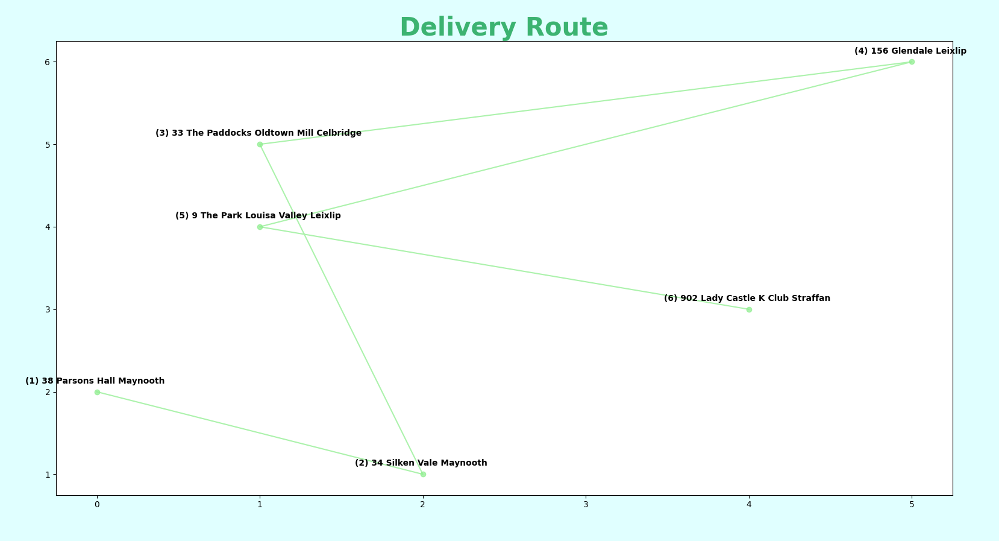

# **PIZZA DELIVERY IN PYTHON** 

## **Description** 
_Converting an app that plans delivery routes, from Java to Python_<br/><br/>

## **Project Goal**
Improve on a previous project with this iteration and devlop more appealing graphics for the client to visualize the delivery route outputted by the application<br/><br/>

## **Tech Used**<br/>


### Graphics libraries
* Matplotlib
<br/><br/>


# **To Run This Project**

```
$ git clone https://github.com/jphoulihan/pizzapy.git
```
<br/>

### **Sample Graph Work In Progress**

<br/>

# **Learning Outcomes**
* Animated graphics with Matplotlib
* Reading csv files and manipulating their contents
* Using the Haversine formula to write a method that calculates distances from GPS coordiantes
* Tackling an NP-hard problem where optimizing a solution is the objective
* Using the heuristic Nearest Neighbour algorithm in deciding a deliver route  

### **Created by**

- [John Houlihan](https://github.com/jphoulihan "Visit John's GitHub")<br/><br/>

### **License**

[](https://opensource.org/licenses/MIT)